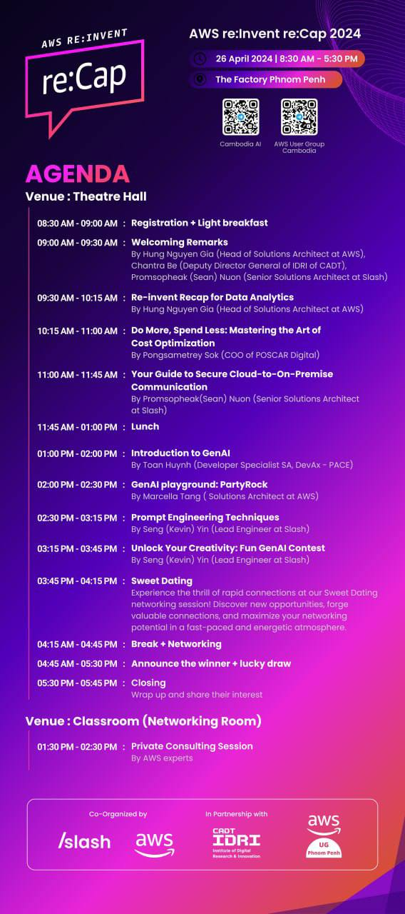

# UG meetup x Re:invent Recap April 26th 2024

## Agenda:

- Re-invent recap for Data Analytics [here](./Reinvent_Recap_2024_Cambodia_v.1.0.pdf)

We will kickstart the event with an insightful presentation by AWS, Head of Solutions Architect, Hung Nguyen Gia, about  the new updates related with Data Analytics services.
Discover how cutting-edge technologies and innovative strategies are revolutionizing data analysis, driving insights, and transforming businesses across industries.

- Do More, Spend Less: Mastering the Art of Cost Optimization

Join us for an insightful session where Pongsametrey Sok, COO of POSCAR Digital, shares his expertise on mastering the art of cost optimization, specifically focusing on efficient utilization of AWS resources.

- Your Guide to Secure Cloud-to-On-Premise Communication [here](./Guide_to_secure_Cloud-to-on-premise_Communication.pdf)

Sean Nuon, Senior Solution Architect at Slash, provides expert insights on establishing secure communication between the cloud and on-premise environments, drawing from his extensive experience and successful projects.

- Introduction to GenAI [here](./Prompt_Engineering.pdf)

This presentation dives into the exciting world of Generative AI (GenAI), a branch of artificial intelligence that can create entirely new content, from text and code to images and music. You'll learn the fundamentals of GenAI and explore how AWS empowers developers to leverage its power with ease.

